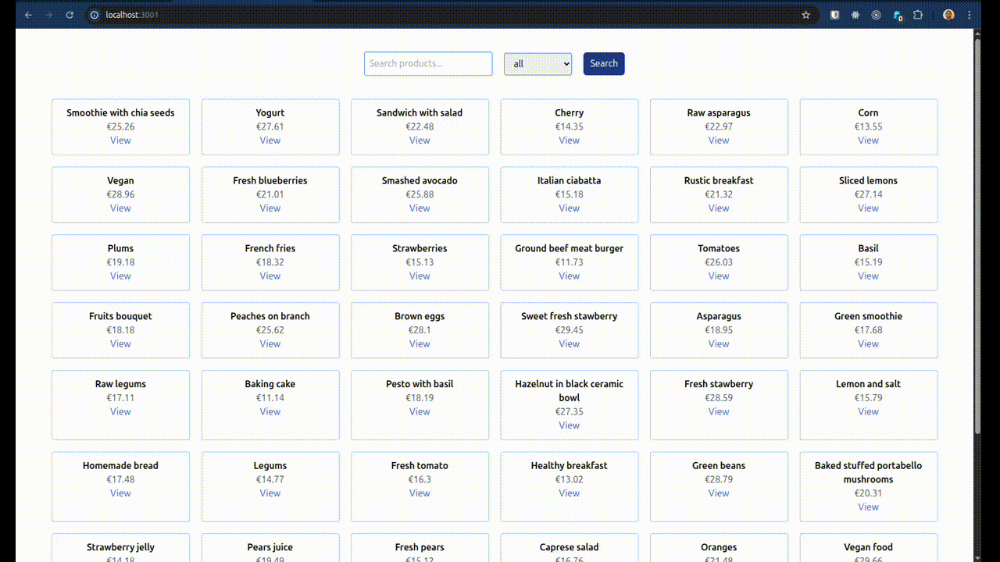

# Basic Nuxt Product App

The Product app implements both next client and server to implement a minimal product search and listing app.

## Setup

Make sure to install dependencies:

```bash
# npm
npm install
```

## Development Server

```bash
# npm
npm run dev
```

open the project url on browser

## Demo (GIF)

# Frontend


# Backend



## Tools used

- Nuxt 4
- Nuxt Server
- PrismaORM
- TailwindCSS
